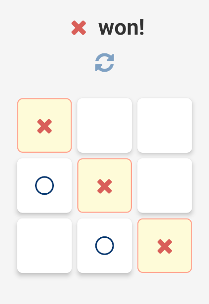

# Tic Tac Toe Game

## Overview

This app allows two players to play the classic Tic Tac Toe game. The players can take turns to place their marks (X or O) on a 3x3 grid, and the first player to align three marks horizontally, vertically, or diagonally wins the game.


## Screenshots


## Installation

To get started with this project, follow these steps:

1. **Clone the repository:**
   ```bash
   git clone https://github.com/miraj004/react-native-tic-tac-toe.git
   cd react-native-tic-tac-toe

2. **Install dependencies**
   ```bash
   npm install

2. **Run the application**
   ```bash
   npx react-native start 
   
   

